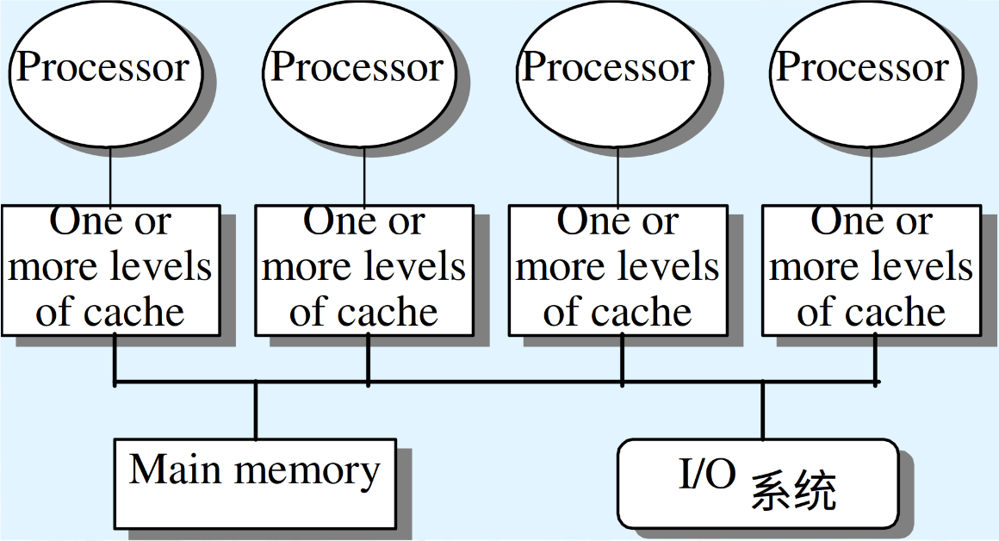

== 线程级并行

在多个处理器上同时执行多个线程，提高程序性能及吞吐量。

处理器之间共享数据有两种方法：

1.所有处理器共享一块内存（集中式共享存储器/对称共享存储器）。

2.每个处理器有自己的内存但其他处理器可以访问（分布式共享存储器）

=== 多处理器体系结构

为了利用拥有n个处理器的MIMD多处理器，通常必须拥有至少n个要执行的线程或进程。因为现在大多数多核芯片中存在多线程，所以这个数字要高出2-4倍。单个进程中的独立线程通常由程序员指定或由操作系统（根据多个独立请求）创建。在另一种极端情况下，一个线程可能由一个循环的数十次迭代组成，这些迭代是由利用该循环中数据并行性的并行编译器生成的。分配给一个线程的计算量称为粒度大小（grain size）。尽管这一数值在考虑如何高效利用线程级并行时很重要，但线程级并行与指令级并行的重要定性区别在于：线程级并行是由软件系统或程序员在较高层级确定的，这些线程由数百条乃至数百万条可以并行执行的指令组成。

线程还能发挥数据级并行的优势，但是开销通常高于使用SIMD处理器或GPU的情况。这意味着数据的粒度必须足够大才能高效地利用并行。例如，尽管向量处理器或GPU也许能够高效地实现短向量运算的并行化，但当并行分散在许多线程中时，粒度大小可能会非常小。以至于这种开销使得在MMD中利用并行性的成本高得令人却步。

根据所包含的处理器数量，可以将现有共享存储器的多处理器分为两类，而处理器的数量又决定了存储器的组织方式和互连策略。我们是按照存储器的组织方式来称呼多处理器的，因为处理器的数量可能会随时间变化。

第一类称为对称（共享存储器）多处理器（symmetric(shared-memory)multiprocessor.SMP），或集中式共享存储器多处理器（centralized shared-memory multiprocessor），其待点是核数量较少，通常不超过32个。由于此类多处理器中的处理器数目非常少，所以处理器可以共享一个集中式存储器并且平等地访问它，这就是对称一词的由来。在多核芯片中，存储器通常在多核之间以集中式的方式共享；大多数（并非全部）多核是SMP。[注意，有些文献使用SMP表示共享存储器处理器（shared memory processor），但这种用法是错误的。]

一些多核对最外层的缓存有不一致的访问，这种结构称为NUCA(nonuniform cache access).因此不是真正的SMP，即使它们只有一个主存储器。IBMPower8设计了一套分布式的L3缓存不同的地址有不同的访问延迟。

在由多个多核芯片组成的多处理器中，每个多核芯片通常都有独立的存储器。因此，存储器是分布式的，而不是集中式的。许多使用分布式存储器的设计可以快速访问局部存储器，而对远程存储器的访问要慢得多。与对局部存储器和远程存储器的访问时间的差异相比，它们对各种远程存储器的访问时间则相差无几。在这样的设计中，程序员和软件系统需要知道访问的是局部存储器还是远程存储器，但是可以忽略远程存储器中的访问分布。由于随着处理器数量的增加，SMP方法的吸引力越来越小，所以大多数的众核处理器使用某种形式的分布式存储器。

SMP体系结构有时也称为一致存储器访问（uniform memory access.UMA）多处理器，这一名称源自以下事实：所有处理器访问存储器的延迟都是一致的，即使当存储器被分为多个组时也是如此。在另一种设计方法中，多处理器采用物理分布式存储器，称为分布式共享存储器(distributedshared memory，DSM)。为了支持更多的处理器，存储器必须分散在处理器之间，而不应当是集中式的；否则，存储器系统就无法在不大幅延长访问延迟的情况下为大量处理器提供高带宽支持。

随着处理器性能的快速提高以及处理器对访存带宽需求的增加，偏好选择分布式存储器的多处理器继续缩小。多核处理器的引入意味着连双芯片多处理器（可能有16~64个处理器核心）也会采用分布式存储器。处理器数目的增加也提升了对高带宽互连的需求。有向网络（即交换机）和间接网络（通常是多维网络）均被用于实现互连。

将存储器分散在节点上，既增加了带宽，也降低了到局部存储器的延迟。DSM多处理器也称为NUMA（非一致存储器访问），因为访问时间取决于数据在存储器中的位置。DSM的主要缺点是让在处理器之间传送数据的过程变复杂了，而且需要在软件开发中付出更多努力才能利用分布式存储器提升的存储带宽。因为大多数基于多核的多处理器（具有多个处理器芯片）使用分布式存储器，所以我们将从这个角度来解释分布式存储器多处理器的工作方式。

在SMP和DSM这两种体系结构中，线程之间的通信是通过共享地址空间完成的，也就是说，任何拥有正确访问权限的处理器都可以对任意存储地址进行访问。与SMP和DSM相关的共享存储器一词指的是地址空间(address space）是共享的。

相比之下，集群和仓库级计算机看起来像由网络连接的独立计算机，如果没有在两个处理器上同时运行的软件协议的帮助，那么一个处理器就无法访问另一个处理器的存储器。此类设计使用消息传送协议在处理器之间传送数据。

==== 并行处理的挑战

多处理器的应用范围很广：从运行基本上互无通信的独立任务，到运行一些必须在线程之间通信才能完成任务的并行程序。有两个重要的障碍使并行处理变得极富挑战性，这两个障碍都可以用Amdahl定律来解释。要克服这些障碍，通常需要一种全面的方法来选择算法及其实现、底层的编程语言和系统、操作系统及其支持功能，以及体系结构和硬件实现。尽管在许多情况下，其中之一是关键瓶颈，但当处理器数量接近100或更多时，通常需要注意软件和硬件的所有方面。

第一个障碍与程序中有限的并行性相关，第二个障碍源于较高的通信成本。由于并行性有限，所以很难在任意并行处理器中实现良好的加速比。

并行处理的第二个重要挑战涉及并行处理器进行远程访问所带来的高延迟。在现有的共享存储器多处理器中，不同核之间的数据通信可能耗费35-50个时钟周期，不同芯片上的核之间的数据通信可能耗费100到500甚至更多个时钟周期（对于大规模多处理器而言)，具体取决于通信机制、互连网络的类型以及多处理器的规模。高通信延迟显然会造成巨大的影响。

并行度不足和远程通信延迟太高是在使用多处理器时最大的两个性能难题。应用程序并行度不足的问题必须通过在软件中采用并行性能更高的新算法来解决，还要在软件系统中尽可能多地使用完整的处理器。远程延迟过高的影响可以由体系结构和程序员来降低。例如。我们可以利用硬件机制（比如缓存共享数据）或软件机制（比如调整数据的结构，使应用程序尽量访问局部存储器）来降低远程访问的频率。我们可以利用多线程或预取（来优化这些延迟。本章主要关注用来降低远程通信延迟所导致的影响的技术。

=== 集中式/对称共享存储器体系结构

使用大型多级缓存可以大大降低处理器对存储带宽的需求，这个重要发现促进了集中式存储器多处理器的发展。最初，这些单核的处理器占据了整个主板，而存储器位于共享总线上随着近期更高性能处理器的出现、存储器需求超出了一般总线的能力，最近的微处理器直接将存储器连接到单个芯片中、这个芯片有时称为后端总线（backside）或内存总线（memory bus），以区别于连接至I/O的总线。在访问一个芯片的局部存储器时，无论是为了I/O操作，还是为了从另一个芯片进行访问，都需要通过“拥有”该存储器的芯片。因此，对存储器的访问是非对称的：对局部存储器的访问更快一些，而对远程存储器的访问要慢一些。在多核结构中，存储器由一个芯片上的所有核共享，但是从一个多核的存储器到另一个多核的存储器的访问仍然是非对称的。

采用对称共享存储器的计算机通常支持对共享数据与私有数据的缓存。私有数据（privatc非对称的。data）供单个处理器使用，而共享数据（shared data）则由多个处理器使用，基本上是通过读写共享数据来实现处理器之间的通信。在私有数据项被缓存时，它的位置被移往缓存，缩短了平均访问时间并降低了所需要的存储带宽。由于没有其他处理器使用数据，所以程序行为与单处理器中的行为相同。在级存共享数据时，可能会在多个缓存中复制共享值。除了降低访问延迟和所需要的存储带宽之外，这一复制过程还可以减少争用—一当多个处理器同时读取共享数据项时可能会出现这种争用。不过，共享数据的缓存也引入了一个新问题：缓存一致性。

==== 多处理器缓存一致性概念

缓存共享数据会引入一个新的问题。因为两个不同的处理器是通过各自的缓存来保留存储器视图的，所以针对同一存储地址，它们可能会看到不同的值。这一难题一般称为缓存一致性问题。注意，之所以存在一致性问题，是因为我们既拥有全局状态（主要由主存储器决定），又拥有局部状态（由各个缓存确定，它们是每个处理器核私有的）。因此，在一个可能会共享某一级别缓存（比如L3）的多核系统中，尽管某些级别的缓存是私有的（比如L1和L2），但一致性问题仍然存在，必须解决。

通俗地说，如果每次读取某一数据项都会返回该数据项的最新写入值，就说这个存储器系统是一致的。这一定义尽管看似正确，但有些含混且过于简单，实际情况要复杂得多。这个简单定义包含了存储器系统行为的两个方面，这两个方面对于编写正确的共享存储器程序都至关重要。第一个方面称为一致性(coherence)，它定义了读操作能返回什么值。第二个方面称为连贯性（consistency），它决定了一个写入值什么时候被读操作返回。

首先来看一致性。如果存储器系统满足以下条件，则说它是一致的。

1. 处理器P对位置X的读操作跟在P对X的写操作之后，并且在P的写操作和读操作之同没有其他处理器对X执行写操作，此读操作总是返回P写入的值。

2. 如果一个处理器对位置X的读操作紧跟在另一个处理器对X的写操作之后，读写操作的间隔时间足够长，而且在两次访问之间没有其他处理器对X执行写操作，那么该读操作将返回写人值。

3. 对同一位置执行的写操作是被串行化（serialized）的，也就是说，在所有处理器看来.任意两个处理器对相同位置执行的两次写操作顺序相同。例如，如果数值1和数值2被先后写到一个位置，则处理器永远不可能先从该位置读取到数值2，之后再读取到数值1。

第一个特性只保持了程序顺序——即使在单处理器中，我们也希望具备这一特性。第二个特性定义了一致性存储器视图的含义：如果处理器持续读取到一个旧数据值，我们就可以明确地说该存储器是不一致的。

对写操作串行化的需求更加微妙，但同样重要。假定我们没有实现写操作的串行化，而且处理器P先写入位置X，然后P2写入位置X。对写操作进行串行化可以确保每个处理器都能看到P2在某一时刻完成的写操作。如果没有对写操作进行申行化，那么某些处理器可能会先看到P2的写入结果，后看到P1的写入结果，并将P1写入的值无限期保存下去。避免此类难题的最简单方法是确保对同一位置执行的所有写操作在所有处理器看来都是同一顺序，这一特性称为写操作串行化(write serialization)。

尽管上述三条特性足以确保一致性，但什么时候才能看到写入值也是一个很重要的问题。我们不能要求在某个处理器向X中写入一个值之后，另一个读取X的处理器能够马上看到这个写入值。比如，如果一个处理器对X的写操作仅比另一个处理器对X的读操作早一点儿，那就不可能确保该读操作会返回这个写入值，因为写入值当时甚至可能还没有离开处理器。写人值到底必须在多久之后被读操作读到？这一问题由存储器一致性模型（memory consistency model）决定,后面将进行讨论。

一致性和连贯性是互补的：一致性确定了向同一存储地址的读写行为，而连贯性则确定了对于其他存储地址的访问的读写行为。现在，做出以下两条假定。第一，在所有处理器都看到写入结果之后，写操作才算完成（并允许进行下一次写人）。第二。对于任何其他存储器访问，处理器不会改变任何写入顺序。这两个条件是指：如果一个处理器先写入位置A，然后写入位置B，那么任何能够看到B中新值的处理器也必须能够看到A中的新值。这些限制条件使处理器能够调整读操作的顺序，但强制处理器必须按照程序顺序来完成写操作。

==== 一致性的基本实现方案

多处理器与I/O的一致性问题尽管在起源上类似，但具有不同的特性，因此解决方案也有所不同。在I/O情景中存在多个数据副本非常罕见（应当尽量避免），而在多个处理器上运行的程序则通常在几个缓存中拥有同一数据的多个副本。在一致性多处理器中，缓存提供了对共享数据项的迁移（migration）与复制（replication）功能。

一致性级存提供的迁移功能可以将数据项移动到本地缓存中，并以透明方式加以使用。这种迁移既降低了访问远程共享数据项的延迟，也降低了对共享存储器的带宽要求。

因为缓存在本地级存中持有数据项的一个副本，所以一致性缓存还为那些被同时读取的北享数据提供了复制功能。复制功能既降低了访问延迟，又减少了对被读共享数据项的争用。支持迁移与复制功能对于共享数据的访问性能非常重要。因此，多处理器没有试图通过软件来避免这一问题的发生，而是采用了一种硬件解决方案，通过引人协议来保持缓存的一致性。

为多个处理器保持缓存一致性的协议称为缓存一致性协议(cache coherence protocol）。实现缓存一致性协议的关键在于跟踪数据块的所有共享状态。任何缓存块的状态都是使用与该块相关联的状态位来保持的，类似于单处理器缓存中保留的有效位和脏位。目前使用的协议有两类，分别采用不同的技术来跟踪共享状态。

- 目录协议——特定物理内存块的共享状态保存在一个位置中，称为目录。共有两种目录式缓存一致性，它们的差异很大。在SMP中，可以使用一个集中目录，与存储器或其他某个串行化点相关联，比如多核的最外层缓存。在DSM中，使用单个目录没有意义，因为这种方法会生成单个争用点，而且考虑到拥有8个或更多核的存储器需求，很难扩展到多个多核芯片。

- 监听协议——如果一个缓存拥有某一物理内存块中的数据副本，它就可以跟踪该块的共享状态，而不必将共享状态保存在同一个目录中。在SMP中，缓存通常可以通过某种广播介质访问（比如将各个核的缓存连接至共享缓存或存储器的总线），所有缓存控制器都监听（snoop）这一介质，以确定自己是否拥有总线或交换访问上所请求块的副本。监听协议也可用作多芯片多处理器的一致性协议，有些设计在目录协议的基础上，在芯片间同步使用监听实现！

监听协议在使用微处理器（单核）的多处理器和通过总线连接到单个共享存储器的缓存中变得流行起来。总线提供了一种非常方便的广播介质来实现监听协议。在多核体系结构中，所有多核都共享芯片上的某一级缓存。因此，一些设计转而使用目录协议，因为其开销较低。

==== 监听一致性协议

有两种方法可以满足一致性需求。一种方法是确保处理器在写入某一数据项之前，获取对该数据项的独占访问。这种类型的协议称为写无效协议（wnite invalid protocol)），因为它在执行写操作时会使其他副本无效。这是目前最常用的协议。独占式访问确保在写入某数据项时，不存在该数据项的任何其他可读或可写副本；这一数据项的所有其他级存副本都作废。

为了了解这一协议如何确保一致性，我们考虑在处理器执行写操作之后由另一个处理器进行读取：由于写操作需要独占访问。所以进行读取的处理器所保留的所有副本都必须无效（这就是这一协议名称的来历）。缓存无效的处理器在进行读操作时会发生缺失，必须提取此数据的新副本。对于写操作，我们要求执行写操作的处理器拥有独占访问，禁止任何其他处理器同时写入。如果两个处理器尝试同时写入同一数据，其中一个将会在竞争中获胜（稍后会介绍如何确定哪个处理器获胜），从而导致另一处理器的副本无效。另一个处理器要想完成自己的写操作，必须获得此数据的新副本，其中必须包含更新后的取值。因此，这一协议实施了写入串行化。

无效协议的一种替代方法是在写入一个数据项时更新该数据项的所有级存副本。这种类型的协议称为写入更新（writeupdate）或写入广播（write broadcast）协议。由于写入更新协议必须将所有写操作都广播到共享缓存行上，所以它要占用相当多的带宽。为此，最近的多处理器几乎都已经选择了实现写无效协议。

**基本实现技术**

在多核中实现无效协议的关键在于使用总线或其他广播介质来执行无效操作。在较早的多芯片多处理器中，用于实现一致性的总线是共享存储器访问总线。在单芯片多核处理器中，总线可能是私有缓存（lntel Corei7中的L1和L2）和共享外部缓存(i7中的L3）之间的连接为了执行一项无效操作，处理器只获得总线访问，并在总线上广播要使其无效的地址。所有处理器持续监听该总线，观测这些地址。处理器检查总线上的地址是否在自己的缓存中，如果在，则使缓存中的相应数据无效。

在写入一个共享块时，执行写操作的处理器必须获取总线访问权限来广播其无效。如果两个处理器尝试同时写入共享块，当它们争用总线时，其广播无效操作的尝试将被串行化。第一个获得总线访问权限的处理器会使它正在写入的块的所有其他副本无效。如果这些处理器尝试写人同一个块，则由总线强制实现的串行化也将串行化它们的写入。这种机制有一层隐含的意思：在获得总线访问权限之前，无法实际完成共享数据项的写操作。所有一致性机制都需要某种方法来串行化对同一缓存块的访问，具体方式可以是串行化对通信介质的访问，也可以是对另一共享结构访问的串行化。

除了使被写人的缓存块的副本无效之外，还需要在发生缓存缺失时定位数据项。在写直达缓存中，可以很轻松地找到一个数据项的最近值，因为所有写入数据都会写回存储器，所以总是可以从存储器中找到数据项的最新值。（对缓冲区的写操作可能会增加一些复杂度，必须将其作为额外的缓存条目进行有效处理。）

对于写回缓存，查找最新数据值要困难一些，因为数据项的最新值可能放在私有缓存中，而不是共享缓存或存储器中。所幸，写回缓存可以为缓存缺失和写操作使用相同的监听机制：每个处理器都监听放在共享总线上的所有地址。如果处理器发现自己拥有被请求缓存块的脏副本，它会提供该缓存块以回应读取请求，并中止存储器（或L3）访问。由于必须从另一个处理器的私有缓存（L1或L2）提取缓存块，所以增加了复杂性，这一提取过程花费的时间通常长于从L3进行提取的时间。由于写回缓存对存储带宽的需求较低，所以他们可以支持更多、更快速的处理器。因此，所有多核处理器都在缓存的最外层级别使用写回缓存。

普通的缓存标记可用于实现监听过程，每个块的有效位使无效操作的实现非常简单。读缺失（无论是由无效操作导致，还是由其他事件导致）的处理也非常简单，因为它们就是依赖于监听功能的。对于写操作，我们需要知道是否缓存了写入块的其他副本，如果不存在其他缓存副本，那么在写回级存中就不需要将写操作放在总线上。如果不用发送写操作，就既可以缩短写入时间，还可以降低所需带宽。

若要跟踪缓存块是否被共享，可以为每个缓存块添加一个状态位，就像有效位和脏位（dirty bit）一样。通过添加一个位来指示该数据块是否被共享，可以判断写操作是否必须生成无效操作。在对处于共享状态的块进行写入时，该缓存在总线上生成无效操作，将这个块标记为独占（exclusive)。这个核不会再发送有关该块的其他无效操作。如果一个缓存块只有唯一刷本、则拥有该唯一副本的核通常称为该缓存块的拥有者。

在发送无效操作时，拥有者缓存块的状态由共享改为非共享（或改为独占）。如果另一个处理器稍后请求这一缓存块，必须再次将状态改为共享。由于监听缓存也能看到所有缺失情况，所以它知道另一个处理器什么时候请求了独占缓存块，以及何时应当将状态改为共享。

每个总线事务都必须检查缓存地址标记，这些标记可能会干扰处理器缓存访问。减少这种干扰的一种方法就是复制这些标记，并将监听访问引导至这些复制的标记。另一种方法是在共享的L3缓存使用一个目录，这个目录指示给定块是否被共享，哪些核心可能拥有它的副本。利用目录信息，可以将无效操作仅发送给拥有该缓存块副本的缓存。这就要求L3必须总是拥有L1或L2中所有数据项的副本，这一特性称为包含。

==== 基本一致性协议的拓展

前面介绍的一致性协议是一种简单的三状态协议，经常用这些状态的首字母来称呼——MSI(modified,shared,invalid，即已修改、共享、无效）协议。这些扩展是通过添加更多的状态和转换来创建的，这些添加内容对某些行为进行优化，可能会提升性能。下面介绍两种最常见的扩展。

1. MESI向基本的MSI协议中添加了“独占”（exclusive）状态，用于表示缓存块仅驻存在一个缓存中，而且是干净的。如果一个块处于独占状态，就可以对其进行写人而不会产生任何无效操作，这优化了一个块先由单个缓存读取再由同一缓存写入的情况。当然，在处于独占状态的块产生读缺失时，必须将这个块改为共享状态，以保持一致性。因为所有后续访问都会被监听，所以有可能保持这一状态的准确性。具体来说，如果另一个处理器发射一个读缺失，则状态会由独占改为共享。添加这一状态的好处是：在由同一个核对处于独占状态的块进行后续写入时，不需要访问总线，也不会生成无效操作，因为处理器知道这个块在这个本地缓存中是独占的；处理器只是将状态改为已修改。添加这一状态非常简单，只需要使用将一致状态编码为独占状态的位，并使用脏位表示这个块已被修改。Intel i7使用了MESI协议的一种变体，称为MESIF，它添加了一个状态（forward），用于表示应当由哪个共享处理器对请求做出响应。这种协议设计用来提高分布式存储器组织结构的性能。

2. MOESI向MESI协议中添加了“拥有”（owned）状态，用于表示相关块由该缓存拥有并且在存储器中已经过时。在MSI和MESI协议中，如果尝试共享处于“已修改”状态的块，会将其状态改为“共享”（在原共享级存和新共享缓存中都会如此），并且必须将这个块写回存储器中。而在MOESI协议中，可以在原缓存中将这个块的状态由“已修改”改为“拥有”，不再将其写到存储器中。（新共享这个块的）其他缓存使这个块保持共享状态；只有原缓存保持“拥有”状态，表示主存储器副本已经过期，指定缓存成为其拥有者。这个块的拥有者必须在发生缺失时提供该块，因为存储器中没有最新内容，如果替换了这个块，则必须将其写回存储器中。AMD Opteron 处理器系列使用了MOESI协议。

==== 对称共享存储器多处理器与监听协议的局限性

随着多处理器中处理器数量的增加，或每个处理器的存储器需求的增长，系统中的任何集中式资源都可能变成瓶颈。即使只有几个核，单个共享总线也会成为多核系统的瓶颈。因此，多核设计已经转向高带宽、独立内存的互连方案，以允许增加更多的核。多数多核芯片使用了三种不同的方法。

1. IBMPower8在一个多核中最多有l2个处理器，它使用8个并行总线连接分布式L3缓存和最多8个独立的存储器通道。

2. Xeon E7使用3个环来连接最多32个处理器、一个分布式L3缓存以及2个或4个存储器通道（取决于配置）。

3. Fajitsu SPARC64 X+使用一个交叉开关将共享的L2缓存连接到最多16个核和多个存储器通道。

SPARC64 X+是一个具有一致访问时间的对称组织结构。Power8对L3缓存和存储器的访问时间不一致。尽管在一个Power8多核内的存储器地址之间的非争用访问时间差异并不大，但是对于存储器的争用，即使在一个芯片内，访问时间差也会变得非常大。XeonE7可以像访问时间一致一样进行操作；在实践中，软件系统通常对存储器进行组织，使存储器通道与核的一个子集相关联。

监听缓存的带宽也会成为一个问题，因为每个缓存必须检查所有缺失，而增加额外的互连带宽只会将问题推给缓存。

增加监听带宽的方法有如下几种：

1. 如前所述，可以复制标记。这使有效的缓存级监听带宽翻了一番。如果假设一半的一致性请求没有命中一个监听请求，并且监听请求的成本只有10个周期（而不是15个周期），第么我们就可以将一个CMR的平均成本降低到12.5个周期。这使得一致性缺失率可以为0.88，或者支持一个额外的处理器（7而不是6）。

2. 如果共享多核（通常是L3）上的最外层缓存，则可以分配该缓存，使每个处理器都有一部分存储器，并处理对该部分地址空间的监听。IBM 12核Power8就使用了这种方法，它在采用NUCA设计的同时，按照过处理器的数量有效地扩展了L3缓存上的监听带宽。如果在L3缓存中有一个监听命中，那么我们仍然必须广播到所有的L2缓存，而L2缓存反过来必须监听它们的内容。因为L3缓存充当监听请求的过滤器，所以L3缓存必须具有包含性。

3. 我们可以将一个目录放在最外层共享缓存的级别（例如L3）上。L3缓存作为监听请求的过滤器，必须具有包含性。在L3缓存使用一个目录意味着我们不需要监听或广播到所有的L2级存，而只需要监听或广播到目录表明可能有块的副本的那些缓存。正如L3缓存可能是分布式的，相关的目录条目也可能是分布式的。这种方法用于lntel Xeon E7系列，该系列支持8-32个核心。

下图展示了带有分布式缓存系统（如方案2或方案3中使用的系统）的多核的组织形式。如果想增加更多的多核芯片以形成更大的多处理器，就需要一个片外网络，以及一种扩展一致性机制的方法。

AMD Opteron展示了监听协议与目录协议之间的另一个折中。存储器被直连到每个多核芯片，最多可以连接4个多核芯片。这个系统为NUMA，因为局部存储器更快一些。Opteron使用点对点连接实现其一致性协议，最多向其他3个芯片进行广播。因为处理器之间的链接未被共享，所以一个处理器要想知道无效操作何时完成，唯一的方法就是显式确认。因此，一致性协议使用广播来查找可能共享的副本，这一点与监听协议类似，但它使用确认来确定操作，这一点与目录协议类似。由于在Opteron实现中，局部存储器仅比远程存储器快一点，所以一些软件把opteron多处理器看作拥有一致的存储器访问。一种解决方案是目录协议，它在发生缺失时不需要向所有缓存进行广播。一些多核设计在多核内目录（Intel Xeon E7），而另一些设计在扩展到多核之外时添加目录。分布式目录消除了对单点串行化所有访问的需要（通常是监听模式中的单点共享总线），任何删除单点串行化的模式都必须处理与分布式目录模式相同的许多挑战。

==== 实现监听缓存一致性

随着总线带宽需求的增加，设计人员不得不面对一项挑战：在不简化总线来串行化事件的情况下实现监听（或目录模式）。在实际实现监听一致性协议时，最复杂的部分在于：在最近的所有多处理器中，写缺失与更新缺失都不是原子操作。检测写缺失或更新缺失、与其他处理器或存储器通信、为写缺失获取最新值、确保所有无效操作可以正常进行、更新缓存，这些步骤不能在单个时钟周期内完成。

在只有一条总线的多核中，如果（在改变缓存状态之前）首先协调连向共享缓存或存储器的总线，并在完成所有操作之前保持总线不被释放，那就可以有效地使上述步骤变成原子操作。处理器怎么才能知道所有无效操作何时完成呢?在早期设计中，当收到所有必要无效操作并在处理时，会使用单根信号线发出信号。收到这一信号之后，生成缺失的处理器就可以释放总线，因为它知道在执行与下一次缺失相关的操作之前，可以完成所有读写行为。只要在执行这些步骤期间独占总线，处理器就能有效地将各个步骤变为原子操作。

在没有单一中央总线的系统中，我们必须寻找其他某种方法，将缺失过程中的步骤变为原子操作。具体来说，必须确保两个处理器尝试同时写人同一数据块的操作（这种情景称为竞争）保持严格排序：首先处理一个写操作，然后再开始执行下一个。这两次写操作中的哪一个操作会赢得竞争并不重要，因为只会有一个获胜者，而它的一致性操作将被首先完成。在使用多条总线的多核中，如果每个存储器块只与一条总线关联，则可以消除竞争，从而确保访问同一个块的两次尝试必须由该公共总线序列化。这个特性，以及重启竞争失败者缺失处理的能力，是在无总线情况下实现监听缓存一致性的关键。

还可以将监听与目录结合在一起，有些设计在多核处理器内部使用监听、在多个芯片之间使用目录，或者在一个级存级别使用目录、在另一个缓存级别使用监听。

=== 集中式/对称共享存储器多处理器的性能

多个处理器共享同一块内存，处理器之间可以很方便的共享资源，并且处理器之间通信比分布式要快。但是处理器访问内存都要占用总线，当处理器数量较多时会因为带宽不足而影响性能。同时也容易出项竞争冒险现象。如果内存损坏，会影响整个系统的工作，稳定性不如分布式共享存储器结构。

在使用监听一致性协议的多核处理器中，性能通常受多种因素影响。具体来说，总体缓存性能由两个因素共同决定：一个是由单处理器缓存缺失造成的流量；另一个是通信导致的流量，它会导致无效及后续的缓存缺失。改变处理器数量、缓存大小和块大小能够以不同方式影响缺失率的这两方面，最终影响总体系统性能。

对单处理器缺失率可以进行3C分类，即容量（capacity）、强制（compulsory）和冲突（conflict），并深入讨论了应用特性和对缓存设计的可能改进。与此类似，有两种来源会引起因处理器之间的通信而导致的缺失（通常称为一致性缺失)。

第一种是所谓的真共享缺失，源自通过缓存一致性机制进行的数据通信。在基于无效的协议中，处理器向共享缓存块的第一次写操作会导致建立该块的所有权无效。此外，当另一个处理器尝试读取这个缓存块中的已修改字时，会发生缺失，并传送结果块。由于这两种缺失都是由处理器之间的数据共享直接导致的，所以都被归类为真共享缺失。

第二种称为假共享缺失，源于使用了基于无效的一致性算法，每个级存块只有一个有效位。如果因为写入块中的某个字（不是正被读取的字）而导致一个块无效（而且后续访问会导致缺失）就会发生假共享。如果接收到无效操作的处理器真的正在使用要写入的字，那这个访问就是真正的共享访问，无论块大小如何都会导致缺失。但是，如果正被写入的字和读取的字不同，那就不会因为这一无效操作而传送新值，而只是导致一次额外的级存缺失，所以它是假共享缺失。在假共享缺失的情况下，块被共享，但缓存中的字没有被实际共享，如果块大小是单个字。那就不会发生缺失。

=== 分布式共享存储器和目录一致性

集中式/对称共享存储器体系结构由于总线带宽等限制，处理器比较少。分布式共享存储器结构则是每个处理器有独立存储器，以允许增加更多核以及处理器。

同时为了减少带宽占用，使用了目录一致性协议。每个处理器在写数据时，只对目录进行通信。目录记录了数据的所有者以及一致性状态等信息。目录与存储器一起分配，使得不同的一致性请求访问不同的目录，从而防止竞争冒险且减少了带宽占用。

每当发生缓存缺失时，监听协议都需要与所有缓存通信，包括对潜在共享数据的写操作。监听式机制没有任何用于跟踪缓存状态的集中式数据结构，这既是它的一个基本优点（因为可以降低成本），也是可扩展性方面的致命弱点。

例如，考虑一个由4个四核多核组成的多处理器，它能够保持每个时钟周期一次数据访问的速率，时钟频率为4GHz。这些应用程序需要4~170GB/s的存储器总线带宽。带有两个DDR4存储器通道的i7支持的最大存储带宽是34GB/s。如果几个i7多核处理器共享同一个存储器系统，存储器系统很容易不堪重负。过去几年中，多核处理器的发展迫使所有设计人员转向某种分布式存储器，以支持各个处理器的带宽要求。

可以通过分布式存储器来提高存储带宽和互连带宽。这样会立刻将局部存储器通信与远程存储器通信分离开来，降低对存储器系统和互连网络的带宽要求。除非不再需要一致性协议在每次缓存缺失时进行广播，否则分布式存储器不会带来太大收益。

监听一致性协议的替代方法是目录协议（directory protocol）。目录中保存了每个可缓存块的状态。这个目录中的信息包括哪些缓存（或缓存集合）拥有这个块的副本，它是否需要更新，等等。在一个拥有共享最外层缓存（即L3）的多核中，实现目录机制比较容易：只需要为每个L3块保存一个位向量，其大小等于核的数量。这个位向量表示哪些私有L2缓存可能具有L3中某个块的副本，无效操作仅会发送给这些缓存。如果L3是包含性的，那这一方法对于单个多核是非常有效的，lnteli7中就采用了这种机制。

在多核中使用单个目录的解决方案是不可扩展的，尽管它避免了广播。这个目录必须是分布式的，并且其分布方式必须能够让一致性协议知道去哪里寻找存储器所有缓存块的目录信息。显而易见的解决方案是将这个目录与存储器一起分配，使不同的一致性请求可以访向不同的目录，就像不同的存储器请求访问不同的存储器一样。如果信息是在外部线存（比如多组的L3）中维护的，那么目录信息可以分布在不同的级存存储体中，从而有效地增加带宽。

分布式目录保留了如下特性：块的共享状态总是放在单个已知位置。利用这一性质，再维护一些信息，指出其他照些节点可能缓存这个块，就可以让一致性协议程免进行广播操作。下图显示了在向每个节点添加目录时，分布式存储器多处理器的组织形式。

image::./pic/7.4.png[]

最简单的目录实现方法是将每个存储器块与目录中的一项相关联。在这种实现方式中，信息量与存储器块数（每个块的大小与L2或L3缓存块相同）和节点数的乘积成正比，其中一个节点就是在内部实现一致性的单个多核处理器或一小组处理器。对于处理器少于数百个的多处理器而言（每个处理器可能是多核的），这一开销不会导致问题，因为当块大小比较合理时，目录开销是可以忍受的。对于大型多处理器，需要一些方法来高效地扩展目录结构，不过，只有超级计算机规模的系统才需要操心这一点。

==== 目录式缓存一致性协议

目录式缓存一致性协议能有效减少维持缓存一致性的流量，可以扩展到大量处理器的系统中去。缺陷是在有较多处理器情况下目录储存开销较大，且访问内存时因为需要查目录，可能增加访问延迟。

当一个处理器请求访问一个内存块时，会首先查询目录以获取状态。

|===
|操作 | 行为

|写操作|如果其他处理器内存块内有缓存该内存块，那么目录发出无效化消息通知其他处理器使他们的副本无效。

|读操作|目录更新共享列表。
|===

和监听协议一样，目录协议也必须实现两种主要操作：处理读缺失和处理共享、干净级存块的写操作。（对于当前正被共享的块，其写缺失的处理就是上述两种操作的组合。）为实现这些操作，目录必须跟踪每个缓存块的状态。在简单协议中，状态可能为下列各项之一。

- 共享——一个或多个节点缓存了这个块，存储器的值是最新的（所有级存中也是如此）。

- 未缓存——所有节点都没有这个缓存块的副本。

- 已修改——只有一个节点有这个级存块的副本，它已经对这个块进行了写操作，所以存储器副本已经过期。这个处理器称为这个块的拥有者。

除了跟踪每个潜在共享存储器块的状态之外，我们还必须跟踪哪些节点拥有这个块的副本，因为在进行写操作时需要使这些副本无效。最简单的方法是为每个存储器块保存一个位向量，当这个块被共享时，这个向量的每一位指明相应的处理器芯片（它可能是一个多核）是否拥有这个块的副本。当存储器块处于独占状态时，我们还可以使用这个位向量来跟踪块的拥有者。为了提高效率，还会跟踪各个缓存中每个缓存块的状态。

每个缓存中状态机的状态与转换与监听缓存时使用的状态机相同，只不过转换时的操作稍有不同。用于定位一个数据项独占副本并使其无效的过程有所不同，因为它们需要在发出请求的节点与目录之间，以及目录与一个或多个远程节点之间进行通信。在监听式协议中，这两个步骤通过向所有节点进行广播而结合在一起。

下表列出了节点之间发送的消息类型。本地节点是发出请求的节点。主节点（home node）是一个地址的存储地址及目录项所在的节点。物理地址空间是静态分布的，所以可以事先知道哪个节点中包含给定物理地址的存储器与目录。例如，地址的高阶位可以提供节点编号，而低阶位提供该节点上存储器内的偏移。本地节点也可能是主节点。当主节点是本地节点时，必须访问该目录，因为副本可能存在于远程节点中。

[cols="1,1,1,3,3", options="header"]
|===
|消息类型 |来源 |目标 |消息内容 |消息的功能

|读缺失
|本地缓存
|主目录
|P, A
|节点 P 在地址 A 发生读缺失；请求数据并将 P 设置为共享者

|写缺失
|本地缓存
|主目录
|P, A
|节点 P 在地址 A 发生写缺失；请求数据并使 P 成为独占拥有者

|无效
|本地缓存
|主目录
|A
|向所有缓存了地址 A 块的远程缓存发送无效请求

|无效
|主目录
|远程缓存
|A
|使地址 A 块数据的共享副本无效

|取数据
|主目录
|远程缓存
|A
|取回地址 A 的块，并发送到它的主目录；把远程缓存中的块状态改为共享

|取数据/无效
|主目录
|远程缓存
|A
|取回地址 A 的块，并发送到它的主目录；使缓存中的块无效

|数据值应答
|主目录
|本地缓存
|D
|从主存储器返回数据值

|数据写回
|远程缓存
|主目录
|A, D
|写回地址 A 的数据值
|===

远程节点是拥有缓存块副本的节点，该副本可能是独占的（只有一个副本），也可能是共享的。远程节点可能与本地节点或主节点相同。在此类情况下，基本协议不会改变，但处理器之间的消息可能会被处理器内部的消息代替。

本节采用存储器一致性的一种简单模型。为了在最大程度上减少消息的类型及协议的复杂性，我们假定这些消息的接受及处理顺序与其发送顺序相同。这一假定在实际中并不成立，并且可能会导致额外的复杂性。在本节，我们利用这一假定来确保在传送新消息之前先处理节点发送的无效操作，就像在讨论监听式协议的实现时所做的假设一样。和在监听情景中一样，我们省略了一些实现一致性协议所必需的细节。具体来说，实现写操作的串行化，以及获知某写入的无效操作已经完成，并不像广播式监听机制中那样简单，而是需要采用明确的确认方法来回应写缺失和无效请求。

=== 同步基础

同步机制通常是以用户级软件例程实现的，这些例程依赖于硬件提供的同步指令。对于较小的多处理器或低争用场景，关键的硬件功能是不可中断的指令或指令序列，它们能以原子方式提取和改变一个值。软件同步机制就是利用这一功能实现的。本节的重点是锁定和解锁同步操作的实现。可以非常轻松地利用锁定和解锁来创建互斥，以及实现更复杂的同步机制。

在高争用情景中，同步可能会成为性能瓶颈，因为争用会引人更多延迟，而且在此种多处理器中延迟可能更大。

==== 基本硬件原语

在多处理器中实现同步时，所需要的关键功能是一组能够以原子方式读取和修改存储地址的硬件原语。没有这一功能，构建基本同步原语的成本就会过高，并且会随着处理器数量的增加而增加。基本硬件原语有许多形式，它们都能够以原子形式读取和修改一个位置，还可以判断读取和写入是否是以原子形式执行的。这些硬件原语是用于构建各种用户级同步操作的基本构建块，包括诸如锁和屏障之类的功能。一般情况下，架构师不希望用户利用基本硬件原语，而是希望系统程序员用这些原语来构建同步库，这个过程通常比较复杂。我们先来看一个硬件原语，并说明如何用它来构建某些基本的同步操作。

构建同步操作的一个典型操作就是原子交换（atomicexchainge），它会将寄存器中的一个值与存储器中的一个值交换。为了理解如何利用这一操作来构建基本的同步操作，假定我们希望构建一个简单的锁，数值0表示这个锁可以占用，数值1表示这个锁不可用。处理器设置锁的具体做法是将寄存器中的1与跟这个锁对应的存储器地址交换。如果其他某个处理器已经申请了访问权，则这一交换指令将返回1，否则返回0。在后一种情况下，这个值也被改变为1，以防止任意进行竞争的交换指令也返回0。

例如，考虑两个试图同时执行交换的处理器：因为只有一个处理器会首先执行交换操作并返回数值0.第二个处理器进行交换时将会返回1，所以不存在竞争问题。使用交换原语来实现同步的关键是这个操作具有原子性：交换是不可分的，两个同时进行的交换将由写人串行化机制进行排序。如果两个处理器都尝试以这种方式对同步变量进行置位，它们不可能认为自己同时对这个变量进行了置位。

还有大量其他原子原语可用于实现同步。它们都拥有一个关键待性：读取和更新存储器值的方式可以让我们判断这两种操作是不是以原子形式执行的。在许多较旧的多处理器中存在一种名为测试并置位（test-and-set）的操作，它会测试一个值，如果通过，就对这个值进行置位。比如，我们可以定义一个操作，它会检测0，并将其值设定为1，其使用方式与使用原子交换的方式类似。另一个原子同步原语是提取并递增（fetch-and-increment）：它返回存储地址的值，并以原子方式使其递增。通过用0值来表示同步变量未被声明，我们可以像使用交换一样使用提取并递增。

实现单个原子存储器操作会引入一些挑战，因为它需要在单个不可中断的指令中进行存储器读写操作。这一要求增加了一致性实现的复杂性，因为硬件不允许在读取与写人之间插入任何其他操作，而且不能死锁。

替代方法是利用一对指令，其中第二条指令返回一个值，从这个值可以判断出这对指令是否像原子指令一样执行。如果任一处理器执行的所有其他指令要么在这对指令之前执行，要么在这对指令之后执行，就可以认为这对指令具有原子性。因此，如果一个指令对具有原子特性，那么所有其他处理器都不能在这个指令对之间改变取值。这是在MIPS处理器和RISC-V中使用的方法。

在RISC-V中，这种指令对包含一个名为保留载入（load reserved）的特殊载入指令[也称为链接载入（load linked）或锁定载入（load locked）]和一个名为条件存储（store conditional）的特殊存储指令。保留载入将rsl指示的存储器内容加载到rd中，并在该存储器地址上创建一个保留。条件存储将rs2中的值存储到rs1提供的存储器地址中。如果对同一存储地址的写操作破坏了对该载入的保留，则条件存储失败并将非零写入rd；如果成功，条件存储写入0。如果处理器在两条指令之间进行了上下文切换，那么条件存储总是失败。

这些指令是按顺序使用的。因为链接载入返回初始值，而条件存储仅在成功时才返回0，所以以下序列会用x4中的值对x1指定的存储地址实现一次原子交换：

[source,asm]
----
try:
mov	x3, x4	;移动交换值
lr	x2, x1	;保留载入
sc	x3, 0(x1)	;条件存储
bnez	x3, try	;分支存储失败
mov	x4, x2	;将载入值放入x4中
----

在这个序列的末尾，x4的内容和x1指定的存储地址已经实现了原子交换。每当处理器介入lr和sc指令之间，修改了存储器中的取值，那么sc在x3中返回0，导致此代码序列再次尝试。

链接载入/条件存储机制的优势之一就是它能用于构建其他同步原语。例如，下面是原子的“提取并递增”：

[source,asm]
----
try:
lr	x2, x1	;保留载入0(x1)
addi	x3, x2, 1	;递增
sc	x3, 0(x1)	;条件存储
bnez	x3, try	;按条件存储失败
----

这些指令通常是通过在称为链接寄存器的寄存器中跟踪lr指令指定的地址来实现的。如果发生了中断，或者与链接寄存器中地址匹配的缓存块无效（比如，另一条sc使其无效），那么链接寄存器将被清除。sc指令只是核查它的地址与链接寄存器中的地址是否匹配。如果匹配，sc将成功，否则会失败。因为在再次尝试向链接载入地址进行存储之后，或者在任何异常之后，条件存储会失败，所以在选择向两条指令之间插入的指令时必须非常小心。具体来说，只有寄存器一寄存器指令才是安全的；否则，就有可能造成死锁，即处理器永远无法完成sc指令。此外，链接载入和条件存储之间的指令数应当很少，以尽可能降低无关事件或竞争处理器导致条件存储频繁失败的概率。

==== 使用一致性实现锁

在拥有原子操作之后，就可以使用多处理器的一致性机制来实现自旋锁(spin lock)——处理器不断尝试获取的锁，它在循环中自旋，直到成功为止。在两种情况下会用到自旋锁：程序员希望短时间拥有这个锁；程序员希望当这个锁可用时，锁定过程的延迟较低。因为自旋锁会占用处理器，在循环中等待锁被释放，所以在某些情况下不适用。

最简单的实现方法是在存储器中保存锁变量，在没有缓存一致性时会使用这种实现方式。处理器可能使用原子操作（比如原子交换）持续尝试获得锁，并测试这一交换过程是否返回了可用锁。为释放锁，处理器只需要在锁中存储数值0即可。下面是锁定地址为x1的自旋锁的代码序列。它将EXCH作为宏，用来表示上一节中的原子交换序列：

[source,asm]
----
addi	x2, R0, #1
lockit:	EXCH	x2, 0(x1)	;原子交换
bnez	x2, lockit	;已经锁定？
----

如果多处理器支持缓存一致性，就可以使用一致性机制将锁放在缓存中，以保持锁值的一致性。将锁放在级存中有两个好处。

1. 可以在本地缓存副本上完成“自旋”过程（尝试在一个紧凑循环中测试和获取锁），不需要在每次尝试获取锁时都请求全局存储器访问。

2. 第二个好处来自以下观察结果：锁访问往往有良好的局部性；也就是说，上次使用了一个锁的处理器，会在不远的将来再次使用它。

在此类情况下，锁值可以驻存在这个处理器的缓存中，从而大幅缩短获取锁所需要的时间。

要实现第一个好处（在本地缓存副本上自旋，而不需要在每次尝试获取锁时都生成存储器请求），需要对这个简单的自旋过程做一点修改。在上述循环中，每当尝试进行交换时都需要一次写操作。如果多个处理器尝试获取这个锁，会分别生成这一写操作。这些写操作大多会导致写缺失，因为每个处理器都尝试获取处于独占状态的锁变量。

因此，应当修改自旋锁过程，使其在自旋过程中读取这个锁的本地副本，直到看到该锁可用为止。然后它尝试通过交换操作来获取这个锁。处理器首先读取锁变量，以检测其状态。处理器不断地读取和检测，直到读取的值表明这个锁已解锁为止。这个处理器随后与所有其他正在进行“自旋等待”的处理器展开竞争，看谁能首先锁定这个变量。所有进程都使用一条交换指令，这条指令读取旧值，并将数值1存储到锁变量中。唯一的获胜者将会看到0.而失败者将会看到由获胜者放在里面的1。（失败者会继续将这个变量设置为锁定值，但这已经无关紧要了。）获胜的处理器在锁定之后执行代码，完成后将0存储到锁定变量中，以释放这个锁，然后再从头开始竞争。

让我们看看这个“自旋锁”机制是如何使用级存一致性机制的。下表展示了当多个进程尝试使用原子交换来锁定一个变量时的处理器和总线（或目录）操作。一旦拥有锁的处理器将0存储到领中，所有其他缓存都将无效，必须提取新值以更新它们保存的锁副本。这种缓存首先获取解锁值（0）的副本，并执行交换。在满足其他处理器的缓存缺失之后，它们发现这个变量已经被锁定，所以必须回过头来进行检测和自旋。

[cols="1,2,2,2,3,3",options="header"]
|===
|步骤 |P0 |P1 |P2 |步骤结束时锁的一致性状态 |总线/目录操作

|1
|拥有锁
|开始自旋，判断锁是否为 0
|开始自旋，判断锁是否为 0
|共享
|以任意顺序满足 P1 和 P2 的缓存缺失后，锁状态变为共享

|2
|将锁设为 0
| （接收到无效操作）
|（接收到无效操作）
|独占（P0）
|来自 P0 锁变量的写入无效操作

|3
|
|缓存缺失
|缓存缺失
|共享
|总线/目录为 P2 缓存缺失提供服务；从 P0 写回，状态为共享

|4
|
|（当总线/目录忙时等待）
|通过锁为 0 检测
|共享
|满足 P2 的缓存缺失

|5
|
|锁为 0
|执行交换，获得缓存缺失
|共享
|满足 P1 的缓存缺失

|6
|
|执行交换，获得缓存缺失
|完成交换，并将锁设为 0
|独占（P2）
|总线/目录为 P2 缓存缺失提供服务；生成无效操作；锁为独占状态

|7
|
|交换完成，返回 1，将锁设置为 1
|进入关键部分
|独占（P1）
|总线/目录为 P1 缓存缺失提供服务；发送无效操作，并从 P2 生成写回操作

|8
|
|自旋，检测锁是否为 0
|无
|无
|无
|===

=== 存储器一致性模型

存储器一致性模型保证了在多处理器对内存的访问的数据一致性，不同模型决定了处理器如何对待内存访问的顺序性，从而影响程序的正确性和性能。

缓存一致性保证了多个处理器看到的存储器内容是一致的，但它并没有说明这些存储器内容应当保持何种程度的一致性。当我们问“何种程度的一致性”时，实际是在问一个处理器必须在什么时候看到另一个处理器更新过的值。由于处理器通过共享变量（用于数据值和同步两种目的）进行通信，于是这个问题便简化为：处理器必须以何种顺序观测另一个处理器的数据写操作?由于“观测另一处理器的写操作”的唯一方法就是通过读操作，所以问题现在变为：在不同处理器对不同位置执行读写操作时，必须保持哪些特性?

“保持何种程度的一致性”这一问题看起来非常简单，实际上却非常复杂，我们通过一个简单的例子来了解一下。下面是来自处理器P1和P2的两段代码：

[source,asm]
----
P1:		A=0;		P2:		B=0;
		....				....
		A=1;				B=1;
L1:		if(B==0)...			if(A==0)...
----

假定这些进程运行在不同处理器上，并且位置A和B最初由两个处理器进行缓存，初始值为0。如果写操作总是立刻生效，并且马上就会被其他处理器看到，那么两个IF语句（标有L1和L2）就不可能同时为真，因为能够到达IF语句就说明A或B必然已经被赋值为1。但假定写无效被延迟了.并且处理器可以在延迟期间继续执行。那么，P1和P2在尝试读取数值之前，可能还没有（分别）看到B和A的无效。现在的问题是：是否应当允许这一行为？如果应当允许，在何种条件下允许?

存储器一致性的最直观的模型称为顺序一致性模型。顺序一致性（sequential consistency）要求任何程序每次执行的结果都是一样的，就像每个处理器是按顺序执行存储器访问操作的，而且不同处理器之间的访问任意交错在一起。顺序一致性使上述示例中的执行结果不可能出现，因为只有在完成赋值操作之后才能启动IF语句。

实现顺序一致性模型的最简单方法是要求处理器推迟完成任意存储器访问，直到该访问操作所导致的全部无效均已完成为止。当然，推迟下一个存储器访问操作，直到前一个访问操作完成为止，这种做法同样有效。别忘了，存储器一致性涉及不同变量之间的操作：两个必须保持顺序的访问操作实际上访问的是不同的存储地址。在我们的例子中，必须延迟对A或B的读取（A==0或B==0），直到上一次写操作完成为止（B=1或A=1）。比如，根据顺序一致性，我们不能简单地将写操作放在写缓冲区中，然后继续执行读操作。

尽管顺序一致性模型给出了一种简单的编程范式，但它可能会降低性能，特别是在多处理器的处理器数量很多或者互连延迟很长时。

尽管顺序一致性模型有性能方面的不足，但从程序员的角度来看，它拥有简单的优点。挑战在于，要开发一种既便于解释又支持高性能实现方式的编程模型。

有一种这样的支持高效实现方式的编程模型，它假定程序是同步的。如果对共享数据的所有访问都由同步操作进行排序，那么这个程序就是同步的。如果满足以下条件。就认为数据访问是由同步操作排序的：在所有可能的执行情景中，一个处理器对某一变量的写操作与另一个处理器对该变量的访问（或者为读取，或者为写入）由一对同步操作隔离开来，其中一个同步操作在第一个处理器执行写操作之后执行，另一个同步操作在第二个处理器执行访问操作之前执行。如果变量可以在未由同步操作排序的情况下更新，则此类情景称为数据竞争（datarace），因为操作的执行结果取决于处理器的相对速度。和硬件设计中的竞争相似，其输出是不可预测的，由此得出了同步程序的另一个名字：无数据竞争（data-race-free）。

作为一个简单的例子，我们考虑一个变量由两个不同处理器读取和更新。每个处理器用锁定和解锁操作将读取和更新操作保护起来，这两种操作是为了确保更新操作的互斥和读操作的一致性。显然，每个写操作与另一个处理器的读操作之间现在都由一对同步操作隔离开来：一个是解锁（在写操作之后），一个是锁定（在读操作之前）。当然，如果两个处理器正在写人一个变量，中间没有插入读操作，那么这些写操作也必须由同步操作隔离开。

人们普遍认同“大多数程序是同步的”。这一观察结果之所以正确，主要是因为：如果这些访问是非同步的，那么程序的行为就可能是不可预测的，因为哪个处理器赢得数据竞争由执行速度决定，并会影响程序结果。即使有了顺序一致性，也很难理清此类程序的执行逻辑程。

序员可以尝试通过构造自已的同步机制来确保顺序，但这种做法需要很强的技巧性，可能会导致充满漏洞的程序，而且在体系结构上可能不受支持，也就是说在以后换代的新多处理器中可能无法工作。因此，几乎所有的程序员都选择使用针对多处理器和同步类型进行了优化的同步库。

最后，使用标准同步原语可以确保即使体系结构实现了一种比顺序一致性模型更宽松的一致性模型，同步程序也会像硬件实现了顺序一致性一样正确运行。

==== 宽松一致性模型

宽松一致性模型的关键思想是允许乱序执行读写操作，但使用同步操作来确保顺序，因此，同步程序的表现就像处理器具备顺序一致性一样。宽松模型多种多样，可以根据它们放松了哪种读取和写入顺序来进行分类。我们利用一组规则来指定顺序，其形式为X→Y，也就是说必须在完成操作X之后才能执行操作Y。顺序一致性模型需要保持所有4种可能的顺序：R→W，R→R、W→R和W→W。宽松模型由它们放松了的顺序来定义。

1. 仅放松W→R顺序将会得到一种称为完全存储排序（total store ordering）或处理器一致性（processor consistency）的模型。由于这种模型保持了写操作之间的顺序，所以许多根据顺序一致性运行的程序也能在这一模型下运行，不用添加同步。

2. 放松W→R和W→W顺序会得到一种称为部分存储顺序（partial store order）的模型。

3. 放松所有4种顺序会得到许多模型、包括弱排序（weak ordering）、PowerPC一致性模型和释放一致性（release consistency，RISC-V一致性模型）。

通过放松这些顺序，处理器有可能获得显著的性能提升，这也是RISC-V、ARMv8以及C++和C语言标准选择释放一致性模型的原因。

释放一致性区分了用于获取对共享变量访问的同步操作(标记为stem:[S_A])和那些释放对象以允许其他处理器获取访问的同步操作（标记为stem:[S_R]）。释放一致性基于这样的观察：在同步程序中，获取操作必须在使用共享数据之前执行，而释放操作必须在共享数据的任何更新之后、下一个获取操作之前执行。这个属性允许我们通过如下观察稍微放松顺序：在获取操作之前的读取或写操作不需要在获取操作之前完成，并且在释放操作之后的读或写操作不需要等待释放操作。因此，保留的排序只涉及stem:[S_A]、和stem:[S_R]，如下表所示。

|===
2+|模型类型 |定义

| |顺序一致性|要求所有处理器的而操作按照程序中规定的顺序执行，且所有处理器看到的操作顺序一致
.4+|宽松一致性模型|完全存储排序或处理器一致性|仅放松W->R顺序。保持了写操作之间的顺序
|部分存储排序|放松W->R和W->W顺序
|弱排序 |放松所有四种顺序
|释放一致性|放松所有四种顺序。区分了用于获取对共享变量访问的同步操作（标记为S~A~）和那些释放对象以允许其他处理器获取访问的同步操作（标记为S
~R~）
|===

释放一致性提供了一种限制最少的模型，它易于检查，并且能确保同步程序将看到顺序连贯的执行。尽管大多数同步操作是获取或释放操作（获取操作通常读取同步变量并自动更新它，而释放操作通常只是写入），但一些操作既充当获取操作又充当释放操作，并导致排序相当于弱排序。尽管同步操作总是确保之前的写操作已经完成，但我们可能需要确保在没有指定同步操作的情况下完成写操作。在这种情况下，一个显式指令(在RISC-V中称为FENCE)被用来确保该线程中所有之前的指令已经完成，包括所有存储器写人和相关的无效操作。

=== 多处理器测试基准和性能模型

为了避免可能的作弊行为，一个典型的原则是不能修改基准测试程序。源代码和数据集是固定的，并且只有唯一的正确结果。对这些原则的任何违反都会导致测试结果无效。

许多多处理器基准测试程序都遵循这些规则。一个共同的例外是允许扩大问题规模，这样可以在有不同数量处理器的系统上运行基准测试程序。也就是说，许多基准测试程序允许弱比例缩放而不是强比例缩放。但即便如此，在比较不同问题规模的测试结果时仍要小心。以下是对不同基准测试程序的具体描述。

- Linpack是一组线性代数例程，这些例程执行高斯消元。它允许弱比例缩放，让用户选择任何规模的问题。例如，超级计算机可能会解决维度为每边1000万的密集矩阵。而且，只要保证计算结果正确并对相同规模的问题执行相同数量的浮点运算。Linpack允许用户以几乎任何形式和任何语言重写Linpack。计算Linpack最快的500台计算机每年在www.top500.org发布两次。排名第一的计算机被新闻界视为世界上最快的计算机。鉴于当今能效的重要性，该组织还发布了Gren500列表，根据运行Linpack的每瓦性能对Top500进行排序，公布世界上能效最高的超级计算机。S

- SPECrate是基于SPEC CPU基准测试（如SPEC CPU 2017）的吞吐量指标。SPECrate并不报告各个程序的性能，而是同时运行该程序的很多副本。因此，它测量的是任务级并行性，因为这些任务之间没有通信。而且可以根据需要运行任意数量的程序副本，这也是一种弱比例缩放的形式。

- SPLASH和SPLASH2 (Stanford Parallel Applications for Shared Memory)是20世纪90年代斯坦福大学的研究成果，目的是提供类似于SPECCPU的并行基准测试程序。它由核心程序和应用程序组成，许多来自高性能计算领域。尽管该程序提供了两组数据集，但仍需要强比例缩放。

- NAS(NASA Advanced Supercomputing)并行基准测试是20世纪90年代对多处理器基准测试程序的另一尝试，由5个来源于流体动力学的核心程序构成，允许通过定义几个数据集实现弱比例缩放。像Linpack一样，这些基准测试程序可以被重写，但编程语言只能使用C或Fortran。

- PARSEC (Princeton Application Repository for Shared MemoryComputer)基准测试程序集由 Pthread（POSIX线程）和OpenMP（Open MultiProcessing）的多线程程序组成。它们主要专注于新兴的计算领域，由9个应用程序和3个核心程序构成。其中8个依赖于数据并行，3个依赖于流水线并行，另一个依赖于非结构化并行。

- 加州大学伯克利分校的研究人员提出了一种方法。他们确定了l3种面向未来应用程序的设计模式。这些设计模式使用框架或核心实现，一些实例包括稀疏矩阵、结构化网格、有限状态自动机、MapReduce和图遍历等。通过将定义保持在高级别层次，他们希望鼓励在系统的任何层次进行创新。因此，速度最快的稀疏矩阵求解器的系统除了使用新型体系结构和编译器之外，还可以使用任何数据结构、算法和编程语言。

基准测试程序原有约束所造成的负面影响是创新被局限到体系结构和编译器中。更好的数据结构、算法、编程语言等通常不能被使用，因为这些可能产生容易令人误解的结果。这样系统可能因为算法而获胜，而不是因为硬件或编译器。

虽然这些准则在计算基础相对稳定时是可以理解的——因为它们是在20世纪90年代提出的，而且是在90年代的前5年——但是，这些准则在编程变革中就不合时宜了。要使变革成功，我们需要鼓励各个层次的创新。

MLPef通常运行在并行计算机上，是ML的最新基准程序，尽管并不是主要的并行计算基准程序。MLPerf包括程序、数据集和基本规则。为跟上ML的快速发展，新版本的MLPerf基准测试每三个月更新一次。MLPerf也包括测试运行时的功耗，以对不同规格的计算机进行规格化。基准测试程序的一个新特色是同时提供测试程序的开源和闭源版本。闭源版本用来严格控制提交规则，以确保系统之间的公平比对。开源版本鼓励创新，包括更好的数据结构、算法、编程系统等。开源版本提交只需要使用相同的数据集执行相同的任务。

==== 性能模型

与基准测试程序相关的一个话题是性能模型。正如我们在本章中看到越来越多的体系结构多样性——多线程、SIMD、GPU———如果我们有一个简单的模型来分析不同体系结构设计的性能，将是十分有益的。这个模型不一定是完美的，只要有所见地就行。

用于分析cache性能的3C模型是性能模型的一个例子。它不是一个完美的性能模型，因为它忽略了块大小、块分配策略和块替换策略等潜在的重要因素。而且，它还存在一些含糊其辞的地方。例如，一次失效在一种设计中可以归为容量失效，而在同样容量的另一个cache中可以归为冲突失效。然而，3C模型已经流行了25年，因为它提供了对程序行为的深入理解，有助于体系结构设计者和程序员根据对该模型的观察改进他们的创新成果。

为了找到并行计算机的这种模型，让我们从小的核心程序开始。尽管这些核心程序的不同数据类型有许多版本，但浮点在几种实现中很常见。因此，在给定的计算机上峰值浮点性能是这类核心程序的速度瓶颈。对于多核芯片，峰值浮点性能是芯片上所有处理器核峰值性能的总和。如果系统中包含多个处理器，那么应该将每个芯片的峰值性能与芯片总数相乘。

对存储器系统的需求可以用峰值浮点性能除以每访问一字节所包含浮点操作数的平均值来估算：

[stem]
++++
\frac{浮点操作数/秒}{浮点操作数/字节} = 字节/秒
++++

存储器每访问一字节所包含的浮点运算比例称为算术强度(arithmetic intensity)。它的计算可以用程序中浮点运算的总数除以程序执行期间内存传输数据的总字节数。

<<<